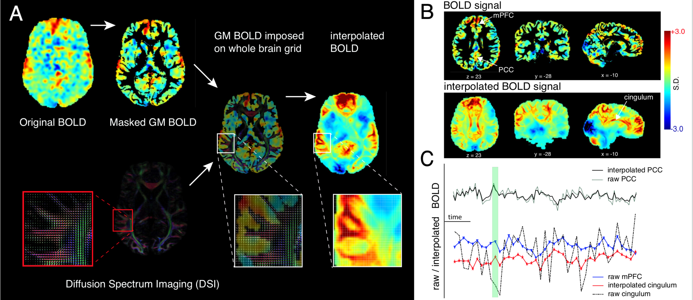

# inpainting-fMRI

Structural mediation of human brain activity revealed by white-matter 
interpolation of fMRI
 
Created by: Anjali Tarun
Date created: 21 May 2019
 
DESCRIPTION:
 
This is the main script for performing white matter
 inpainting of fMRI data using a voxel-wise brain connectome.
 The code for constructing the connectome can be found in a separate repository.
    
The pipeline works as follows:
 
            1. The voxel-wise brain grid is first constructed. This
            is done by first extracting the ODF from the diffusion
            data. After which, the brain graph is built and the 
            Laplacian is computed. 
 
            2. Graph signal recovery is performed by minimizing a
            cost function that is described in the manuscript. 
            The cost function balances between (1) minimizing the RSS
            and retaining the original GM signals, and (2) imposing
            smoothness with respect to the structure of the graph. 
 
 
The pipeline is adjusted to take HCP folder as input and outputs 
the brain graph adjacency matrix, Laplacian, and the corresponding
interpolated volumes for each subject and session.
 
Input:  HCP folder containing subject IDs
        The HCP folder should contain (1) preprocessed diffusion data (2)
        processed fMRI volumes (3) Extended structural volumes
Output: Voxel-brain graph and interpolated volumes
 
The struct 'param' contains all the parameter information and paths.

Research paradigm:

